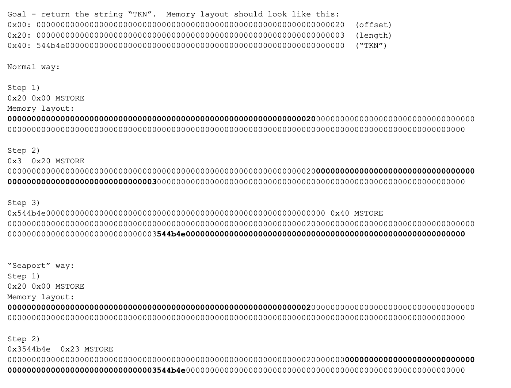

# Hello, world!

Note: This section is a continuation of ['The Basics'](/tutorial/the-basics/). If you have not read it yet we recommend you take a look at it before continuing!

---


Within ['The Basics'](/tutorial/the-basics/) we mentioned how `"Hello, world!"` is quite an advanced concept for Huff. The reason being that we have to an understanding of how string's are encoded in the EVM.
## Primer: ABI Encoding
As strings are dynamic types it is not as simple as returning the UTF-8 values for `"Hello, world!"` (`0x48656c6c6f2c20776f726c6421`). In the ABI standard, dynamic types are encoded in 3 parts.
1. The offset of the dynamic data. (A pointer to the start of the dynamic data (uint256))
2. The length of the dynamic data. (uint256)
3. The values of the dynamic data. (dynamic length)

Each part will look as follows for the string `"Hello, world!"`:
```
[Byte number]   [DATA]
0x00            0000000000000000000000000000000000000000000000000000000000000020 // The location of the "Hello, world!" data (dynamic type).
0x20            000000000000000000000000000000000000000000000000000000000000000d // The length of "Hello, world!" in bytes
0x40            48656c6c6f2c20776f726c642100000000000000000000000000000000000000 // Value "Hello, world!"
```

Encoding dynamic values takes alot of work!! In order to return `"Hello, world!"` we must return 96 bytes!

You might think that we can populate the memory in sequential order starting with the location (0x00), then length (0x20), and then the value (0x40). However, this would result in the value "Hello, world!" being left padded. We would get:
```
[Byte number]   [DATA]
0x00            0000000000000000000000000000000000000000000000000000000000000020 // The location of the "Hello, world!" data (dynamic type).
0x20            000000000000000000000000000000000000000000000000000000000000000d // The length of "Hello, world!" in bytes
0x40            0000000000000000000000000000000000000048656c6c6f2c20776f726c6421 // Wrong encoding!
```
This is not what we need. Instead, we're going to leverage what we know about memory to produce the right result:
- Memory is always expanded in 32 byte increments
- We can store a value starting from any index
- Values are left padded

Additionaly, in this example, we know that we want to store the location starting at 0x00 and the length starting at 0x20.

Armed with this knowledge, we can store the value "Hello, world!" at 0x2d (starting index of length 0x20 + the length of the data in bytes 0x0d). The first 0x2d (decimal 45) bytes are set to zero as a result of memory expansion. The left padding of "Hello, world!" is stored from bytes 0x2d (decimal 45)-> 0x3f (decimal 63).

This means our important bytes (`48656c6c6f2c20776f726c6421`) start at 0x40. However, since memory is expanded in 32 byte increments empty memory will be expanded with zeros to byte 0x60 (decimal 96), exactly what we need!
```
[Byte number]   [DATA]
0x00            0000000000000000000000000000000000000000000000000000000000000000 // Empty
0x20            0000000000000000000000000000000000000000000000000000000000000000 // Empty
0x40            48656c6c6f2c20776f726c642100000000000000000000000000000000000000 // Correct encoding
```

Now we have "Hello, world!" stored, we have two things left to do. Store the length of the string in 0x20, and a pointer to the start of our dynamic data 0x00! Now let's see what that looks like in code.

## Implementation
The following `MAIN` macro steps through this encoding in a clear way (gas optimization will be left as an exercise to the reader!)
```
#define macro MAIN() = takes(0) returns(0) {
    // Store string "Hello, world1" in memory at 0x40
    // 0x2d is listed as mstore pads the value
    0x48656c6c6f2c20776f726c6421        // ["Hello, world!"]
    0x2d                                // [0x2d, "Hello, world!"]
    mstore                              // []

    // store length of string at 0x20
    0x0d                                // [0x0d]
    0x20                                // [0x20, 0x0d]
    mstore                              // []

    // store dynamic offset at 0x00 (string encoding starts at 0x20)
    0x20                                // [0x20]
    0x00                                // [0x00, 0x20]
    mstore                              // []

    // return full 96 byte value
    0x60                                // [0x60]
    0x00                                // [0x00, 0x60]
    return                              // []
}
```

Have a look how memory is set and what is returned interactively within the [evm.codes playground](https://www.evm.codes/playground?unit=Wei&codeType=Bytecode&code='6c48656c6c6f2c20776f726c6421~2dz0d~20z20~00z~~00f3'~60z52~%01z~_) for this example.

## The Seaport method of returning strings

Notice in the previous example that 3 adjacent words (32 bytes each) are being stored in memory.  The 1st word is the offset and the 2nd word is the length, both of which are left padded as all values are.  The 3rd word is right padded because its bytes.  Notice the length and the bytes are adjacent to each other in the memory schema.

If we take the length and the bytes, and concatenate them, we would get: `0x0d48656c6c6f2c20776f726c6421` which becomes left padded:

```
0x000000000000000000000000000000000000000d48656c6c6f2c20776f726c6421
```

Now, instead of starting the second word at `0x20`, if we offset that by 13 bytes (starting at `0x2d` instead of `0x20`) then we line it up so that the `0d` falls in the right most (lowest) bits of the second word and the remaining bytes start immediately in the first leftmost (highest) byte.  This is a common technique in Huff and was also made popular by [Seaport's _name() function](https://github.com/ProjectOpenSea/seaport/blob/fb1c3bf4c25a32ae90f776652a8b2b07d5df52cf/contracts/Seaport.sol#L95-L108).

Here is a diagram illustrating the "Seaport" method using the string "TKN":


